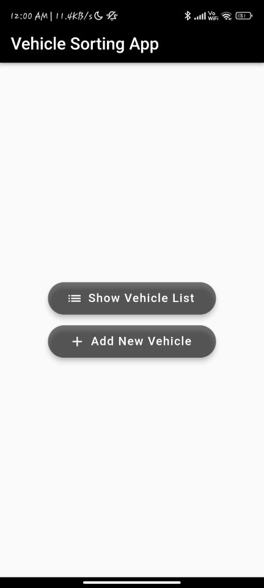
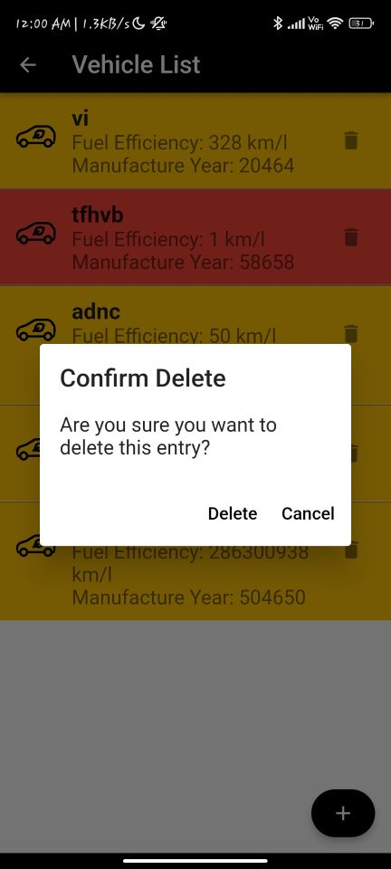

# Vehicle Efficiency Application


## Description

The Vehicle Efficiency Application is a Flutter-based mobile app that helps users evaluate the environmental impact of their vehicles. The app checks certain conditions and provides an assessment of whether the vehicles are eco-friendly or not. It calculates and displays various efficiency metrics to help users make informed decisions about their vehicles' impact on the environment.

## Features

- Check vehicle emission standards and compare with user's vehicle
- Provide eco-friendly vehicle suggestions based on efficiency metrics
- User-friendly interface for easy navigation and input

## Screenshots








### Prerequisites

- Flutter SDK (version ^2.5.0)
- Android Studio or Xcode for emulators/simulators
- Have made use of Firebase database to store, modify and delete the vehicles data in the application designed.
  


## How to Use

1. Clone the repository:
   ```bash
   git clone https://github.com/vishalranka2003/Vehicle_sort/
2. Navigate to project directory
   ```bash
   cd Vehicle_sort
3. Install the dependencies:
   ```bash
   flutter pub get
4. Launch the app on your preferred emulator/simulator or physical device using the following command:
   ```bash
   flutter run

